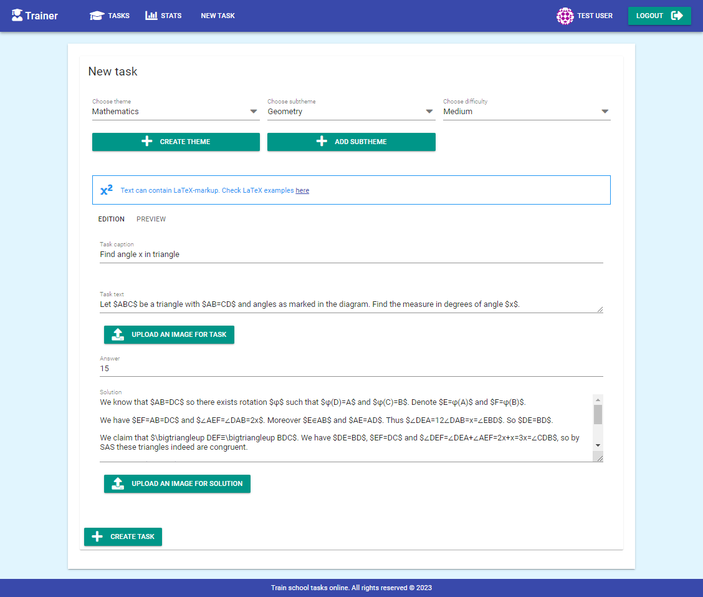
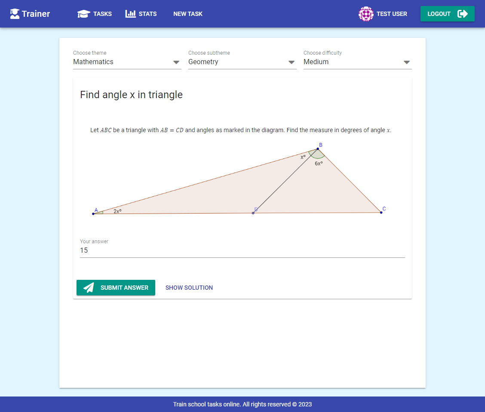

# Trainer (2018)

## About
A simple pet project for creating (for admins) and solving tasks for preparation for exams and etc. It's allowed to use Latex in task text and explanation as well as images.  

### Task creation


### Task solving


## Setup

### Client

#### Project setup

1. Install NodeJS v.10
1. Install vue cli `npm i -g @vue/cli`
1. From directory `client` run `npm install`

#### Compiles and hot-reloads for development
```
npm run serve
```

#### Compiles and minifies for production
```
npm run build
```


#### Lints and fixes files
```
npm run lint
```

## Server
Run function `main` from `src/Application.kt`